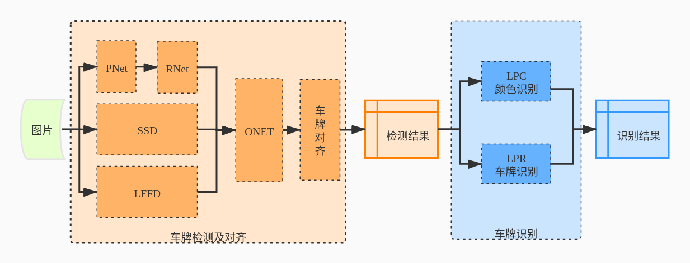
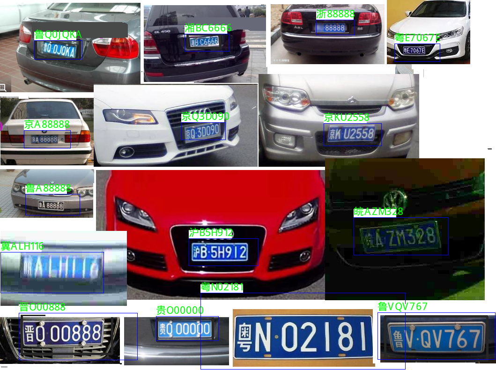
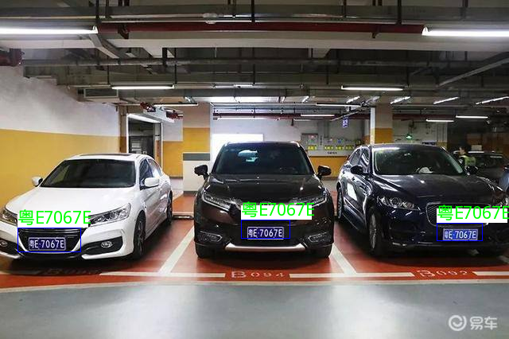
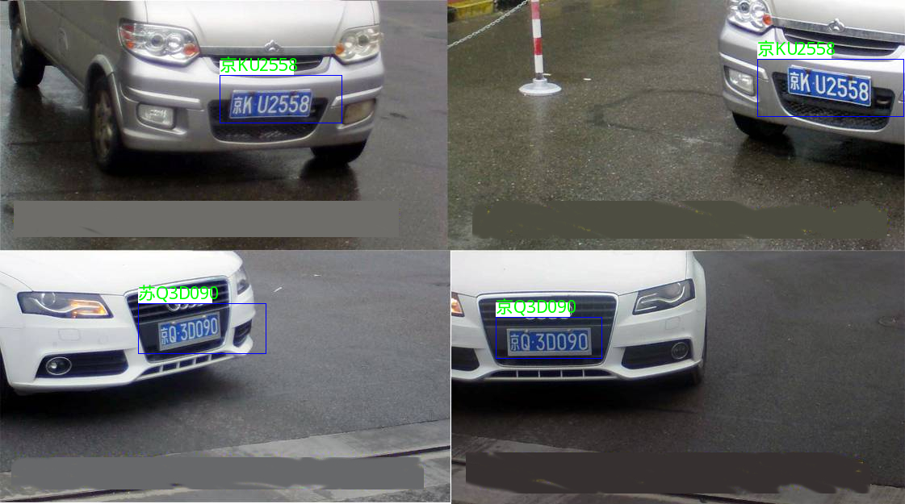

 <div align="center">

</div>

# mobile-lpr
Mobile-LPR 是一个面向移动端的准商业级车牌识别库，以NCNN作为推理后端，使用DNN作为算法核心，支持多种车牌检测算法，支持车牌识别和车牌颜色识别。

## 特点

- 超轻量，核心库只依赖NCNN，并且对模型量化进行支持
- 多检测，支持SSD,MTCNN,LFFD等目标检测算法
- 精度高，LFFD目标检测在CCPD检测AP达到98.9，车牌识别达到99.95%， 综合识别率超过99%
- 易使用，只需要10行代码即可完成车牌识别
- 易扩展，可快速扩展各类检测算法

## 算法流程

## 构建及安装
1. 下载源码
```sh
git clone https://github.com/xiangweizeng/mobile-lpr.git
```
2. 准备环境
- 安装opencv4.0及以上， freetype库
- 安装cmake3.0以上版本，支持c++11的c++编译器，如gcc-6.3

3. 编译安装
```sh
mkdir build
cd build
cmake ..
make install
```

## 使用及样例
1.使用MTCNN检测
- 代码样例
```cpp
void test_mtcnn_plate(){
    pr::fix_mtcnn_detector("../../models/float", pr::mtcnn_float_detector);
    pr::PlateDetector detector = pr::IPlateDetector::create_plate_detector(pr::mtcnn_float_detector);

    pr::fix_lpr_recognizer("../../models/float", pr::float_lpr_recognizer);
    pr::LPRRecognizer lpr =  pr::float_lpr_recognizer.create_recognizer();
    Mat img = imread("../../image/plate.png");

    ncnn::Mat sample = ncnn::Mat::from_pixels(img.data, ncnn::Mat::PIXEL_BGR, img.cols, img.rows);
    std::vector<pr::PlateInfo> objects;
    detector->plate_detect(sample, objects);
    lpr->decode_plate_infos(objects);

    for (auto pi : objects)
    {
        cout << "plate_no: " << pi.plate_color << pi.plate_no << " box:" << pi.bbox.xmin << ","
        << pi.bbox.ymin << "," << pi.bbox.xmax << "," << pi.bbox.ymax << "," << pi.bbox.score << endl;
    }
}
```
- 效果示例:


2.使用LFFD检测
- 代码样例
```cpp
void test_lffd_plate()
{
    pr::fix_lffd_detector("../../models/float", pr::lffd_float_detector);
    pr::PlateDetector detector = pr::IPlateDetector::create_plate_detector(pr::lffd_float_detector);

    pr::fix_lpr_recognizer("../../models/float", pr::float_lpr_recognizer);
    pr::LPRRecognizer lpr =  pr::float_lpr_recognizer.create_recognizer();
    Mat img = imread("../../image/plate.png");

    ncnn::Mat sample = ncnn::Mat::from_pixels(img.data, ncnn::Mat::PIXEL_BGR, img.cols, img.rows);
    std::vector<pr::PlateInfo> objects;
    detector->plate_detect(sample, objects);
    lpr->decode_plate_infos(objects);

    for (auto pi : objects)
    {
        cout << "plate_no: " << pi.plate_color << pi.plate_no << " box:" << pi.bbox.xmin << ","
             << pi.bbox.ymin << "," << pi.bbox.xmax << "," << pi.bbox.ymax << "," << pi.bbox.score << endl;
    }
}
```

- 效果示例:



3.使用SSD检测
- 代码样例
```cpp
void test_ssd_plate()
{
    pr::fix_ssd_detector("../../models/float", pr::ssd_float_detector);
    pr::PlateDetector detector = pr::IPlateDetector::create_plate_detector(pr::ssd_float_detector);

    pr::fix_lpr_recognizer("../../models/float", pr::float_lpr_recognizer);
    pr::LPRRecognizer lpr =  pr::float_lpr_recognizer.create_recognizer();
    Mat img = imread("../../image/manys.jpeg");

    ncnn::Mat sample = ncnn::Mat::from_pixels(img.data, ncnn::Mat::PIXEL_BGR, img.cols, img.rows);
    std::vector<pr::PlateInfo> objects;
    detector->plate_detect(sample, objects);
    lpr->decode_plate_infos(objects);

    for (auto pi : objects)
    {
        cout << "plate_no: " << pi.plate_color << pi.plate_no << " box:" << pi.bbox.xmin << ","
             << pi.bbox.ymin << "," << pi.bbox.xmax << "," << pi.bbox.ymax << "," << pi.bbox.score << endl;
    }
}
```

- 效果示例:



4.使用量化模型
- 代码样例
```cpp
void test_quantize_mtcnn_plate(){
    pr::fix_mtcnn_detector("../../models/quantize", pr::mtcnn_int8_detector);
    pr::PlateDetector detector = pr::IPlateDetector::create_plate_detector(pr::mtcnn_int8_detector);

    pr::fix_lpr_recognizer("../../models/quantize", pr::int8_lpr_recognizer);
    pr::LPRRecognizer lpr =  pr::int8_lpr_recognizer.create_recognizer();
    Mat img = imread("../../image/plate.png");

    ncnn::Mat sample = ncnn::Mat::from_pixels(img.data, ncnn::Mat::PIXEL_BGR, img.cols, img.rows);
    std::vector<pr::PlateInfo> objects;
    detector->plate_detect(sample, objects);
    lpr->decode_plate_infos(objects);

    for (auto pi : objects)
    {
        cout << "plate_no: " << pi.plate_color << pi.plate_no << " box:" << pi.bbox.xmin << ","
             << pi.bbox.ymin << "," << pi.bbox.xmax << "," << pi.bbox.ymax << "," << pi.bbox.score << endl;
    }
}

```

- 效果示例:



## 后续工作
- 添加更优的算法支持
- 优化模型，支持更多的车牌类型，目前支持普通车牌识别，欢迎各位大神提供更好的模型
- 优化模型，更高的精度
- 添加Android 使用实例
- 性能评估

## 参考
1. [light-LPR](https://github.com/lqian/light-LPR) 本项目的模型大部分来自与此
2. [NCNN](https://github.com/Tencent/ncnn) 使用NCNN作为后端推理
3. [LFFD](https://github.com/YonghaoHe/A-Light-and-Fast-Face-Detector-for-Edge-Devices) LFFD的模型及实现
4. [CCPD](https://github.com/detectRecog/CCPD) 中国车牌数据集，达到200万样本
5. [HyperLPR](https://github.com/zeusees/HyperLPR) 一个开源的车牌识别框架